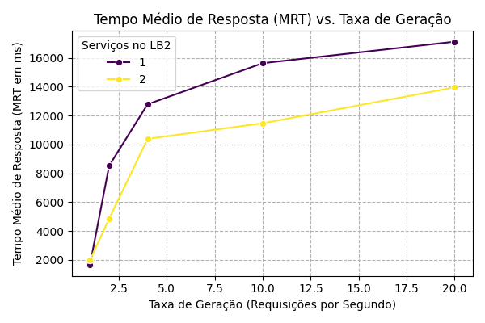
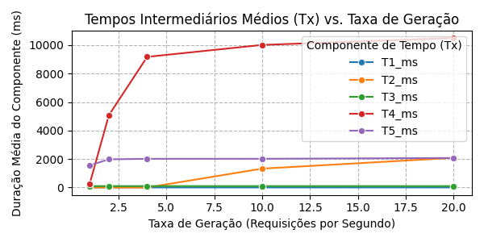
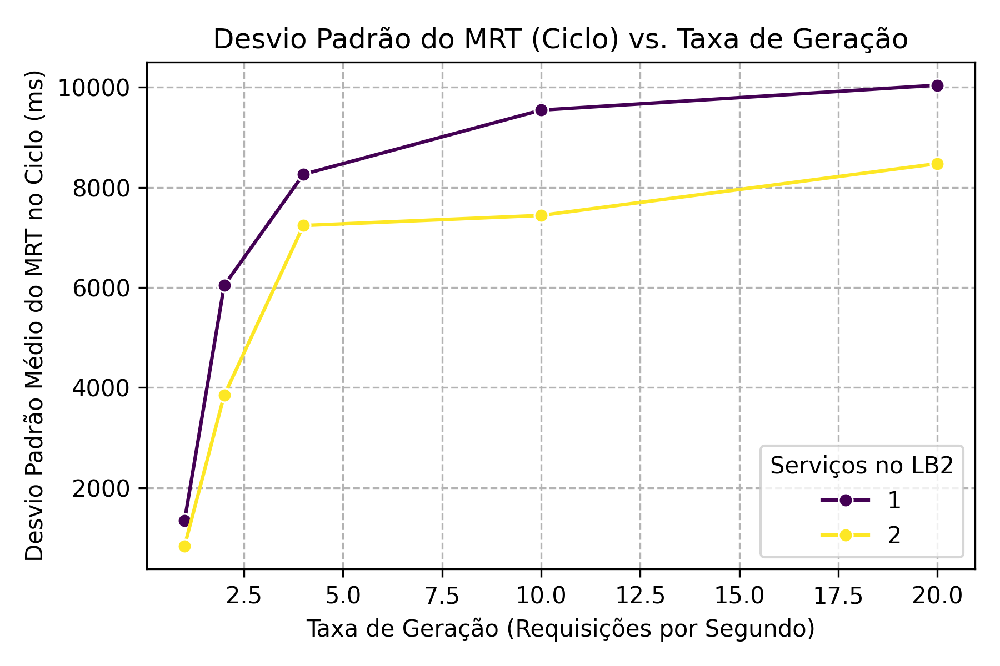

# PASID-VALIDATOR em Python (Pós-Entrega 02)

Este projeto é uma reimplementação em Python do sistema PASID-VALIDATOR. O objetivo principal é simular um sistema distribuído cliente-servidor(es), integrado com um serviço de Inteligência Artificial (IA) para classificação de texto (posicionamento), e coletar dados de desempenho como o Tempo Médio de Resposta (MRT) e tempos intermediários de processamento.

O sistema foi desenvolvido para permitir a execução dos seus componentes (Source, LoadBalancers, Services) tanto localmente (para depuração e testes iniciais) quanto em um ambiente containerizado usando Docker e Docker Compose, facilitando a condução de experimentos de desempenho distribuídos. Atualmente, o sistema está funcional e pronto para a fase de experimentação e análise de resultados.

## Arquitetura do Sistema Otimizada

O sistema é composto pelos seguintes componentes principais, com uma estratégia de carregamento de IA otimizada:

1.  **Source (`source.py`)**:
    * Gera requisições (mensagens contendo texto para análise de posicionamento pela IA).
    * Envia as requisições para o primeiro Load Balancer (LB1).
    * Recebe as mensagens processadas de volta do último componente (Serviço do LB2, que realizou a inferência de IA).
    * Calcula o Tempo Médio de Resposta (MRT) e o Desvio Padrão das respostas para cada ciclo experimental.
    * Calcula os tempos intermediários ($T_1$ a $T_5$) com base nos timestamps coletados.
    * Envia mensagens de configuração para o Load Balancer 2 (LB2) para variar o número de serviços de IA ativos.
    * Implementa lógicas de espera para sincronizar com a inicialização e reconfiguração dos LoadBalancers.

2.  **LoadBalancer (`load_balancer.py`)**:
    * Atua como um middleware, recebendo requisições e distribuindo-as para seus `Service`s internos.
    * Duas instâncias de LoadBalancer são usadas com funcionalidades distintas:
        * **LB1**:
            * Recebe requisições do `Source`.
            * **Não carrega o modelo de IA.** Seus `Service`s internos atuam primariamente como encaminhadores rápidos, apenas registrando timestamps e repassando as mensagens (incluindo o texto original para IA) para o LB2. Um pequeno delay simulado pode ser configurado para estes serviços.
        * **LB2**:
            * Recebe requisições dos serviços do LB1.
            * **Carrega o modelo de IA (BERTimbau) uma única vez** durante sua inicialização e compartilha essa instância de modelo e tokenizer com todos os seus `Service`s internos.
            * Seus `Service`s internos realizam o processamento de IA no texto recebido, anexam a predição e enviam a mensagem processada de volta para o `Source`.
            * É o alvo das mensagens de configuração do `Source` para variar a quantidade de `Service`s com IA.
    * Mantém uma fila interna para as requisições.
    * Utiliza uma política de Round Robin (com verificação de disponibilidade) para despachar mensagens para os serviços.
    * Cria e gerencia instâncias de `Service`, passando a instância do modelo de IA e do tokenizer (se este LoadBalancer for o LB2) ou `None` (se for o LB1).

3.  **Service (`service.py`)**:
    * Representa um nó de processamento.
    * Recebe uma mensagem do seu `LoadBalancer` pai, junto com instâncias (que podem ser `None`) de um modelo de IA e tokenizer, e uma indicação se ele esperava ter IA.
    * **Se um modelo de IA e tokenizer são fornecidos (caso dos serviços do LB2):**
        * Realiza o processamento de IA (classificação de texto usando BERTimbau) no payload da mensagem.
        * Anexa a predição da IA e os timestamps de processamento à mensagem.
    * **Se nenhum modelo de IA ou tokenizer é fornecido (caso dos serviços do LB1):**
        * Simula um pequeno tempo de processamento/encaminhamento (configurável).
        * Anexa timestamps de trânsito à mensagem, mas não realiza inferência de IA.
        * Preserva o payload de texto original para ser processado pelo próximo serviço na cadeia (Svc2).
    * Encaminha a mensagem processada (ou apenas com timestamps atualizados) para o próximo destino configurado.

O fluxo principal é:
`Source` → `LB1` → `Serviço(s) do LB1 (Encaminhamento)` → `LB2 (Carrega IA)` → `Serviço(s) do LB2 (Processamento IA)` → `Source`

## Estrutura do Projeto

```text
pasid_validator_python/
│
├── src/
│   ├── components/
│   │   ├── __init__.py
│   │   ├── source.py
│   │   ├── load_balancer.py
│   │   └── service.py
│   │
│   └── utils/
│       ├── __init__.py
│       └── logger_setup.py
│
├── main.py                 # Ponto de entrada para executar os componentes
│
├── Dockerfile              # Define a imagem Docker
├── docker-compose.yml      # Orquestra os containers
├── .env                    # Variáveis de ambiente para docker-compose
├── requirements.txt        # Dependências Python
│
├── logs/                   # Diretório para arquivos de log (gerado automaticamente)
│   └── experiment_....log  # Logs detalhados das execuções
│
├── SEU_CAMINHO_PARA_MODELO_BERT/  # Ex: D:/IC/youtube_model_1124 (Definido em .env)
│   └── models/
│       └── posicionamento_BERTimabauPT-BR_211124.bin # Seu arquivo .bin fine-tuned
│
└── README.md
```
**Nota sobre a pasta do modelo BERT:** A pasta `SEU_CAMINHO_PARA_MODELO_BERT/` (ex: `D:/IC/youtube_model_1124`) deve ser criada por você no seu computador (host) e conter seu arquivo `.bin` fine-tuned. Os arquivos de configuração do modelo base BERT (`config.json`, `vocab.txt`, etc., do `neuralmind/bert-large-portuguese-cased`) são gerenciados pelo cache da Hugging Face, que é montado como um volume Docker (`huggingface_cache`) definido no `docker-compose.yml`.

## Pré-requisitos

* Python 3.9+
* Docker e Docker Compose
* Dependências Python listadas em `requirements.txt` (serão instaladas automaticamente no container Docker, ou podem ser instaladas localmente com `pip install -r requirements.txt`).
    * `torch`
    * `transformers`
    * `scikit-learn` (se usado)
    * `numpy`
    * `pandas` (para o script `parse_logs.py`)
    * `matplotlib` (para o script `gerar_graficos.py`)
    * `seaborn` (para o script `gerar_graficos.py`)
* Arquivo `.bin` do modelo BERT fine-tuned (ex: `posicionamento_BERTimabauPT-BR_211124.bin`) disponível localmente.

## Como Executar

### Execução Local (para depuração)

1.  **Configurar `main.py`:** Ajuste `CAMINHO_MODELO_BERT_HOST`.
2.  **Executar Componentes (em terminais separados):**
    ```bash
    python main.py --component source --env local
    python main.py --component lb1 --env local
    python main.py --component lb2 --env local
    ```
3.  **Executar Modo "all" (em um único terminal):**
    ```bash
    python main.py --component all --env local
    ```

### Execução com Docker Compose (Ambiente de Experimento)

1.  **Crie e Configure o arquivo `.env`:**
    * Na raiz do projeto, defina `CAMINHO_MODELO_BERT_HOST_ENV` para o caminho da sua pasta de modelo BERT (ex: `D:/IC/youtube_model_1124`).
    * Defina as portas `SOURCE_LISTEN_PORT`, `LB1_LISTEN_PORT`, `LB2_LISTEN_PORT` se diferente dos defaults.
    * Defina `CAMINHO_MODELO_BERT_CONTAINER_ENV` (ex: `/app/bert_model_data`).
2.  **Construa as Imagens Docker:**
    ```bash
    docker-compose build
    ```
3.  **Inicie os Serviços:**
    ```bash
    docker-compose up
    ```
    * Para rodar em background: `docker-compose up -d`
4.  **Monitore os Logs:** `docker-compose logs -f` ou `./logs/experiment_....log`.
5.  **Pare os Serviços:** `docker-compose down` (use `-v` para remover volumes).

## Configuração dos Experimentos

Os experimentos são configurados modificando os parâmetros em `SOURCE_CONFIG_DOCKER` no `main.py`:
* `arrival_delay_ms`: Controla a taxa de chegada (ex: `[1000, 500, 250, 100, 50]`).
* `max_messages_per_cycle`: Número de mensagens por ciclo (ex: `30`).
* `qtd_services_variation`: Número de serviços de IA no LB2 (ex: `[1, 2]`).

Ajuste `initial_system_wait_time_sec` e `lb_reconfig_wait_time_sec` no `source.py` conforme necessário para a estabilização dos LBs.

## Coleta e Processamento de Dados

1.  Execute os experimentos para cada combinação de parâmetros, modificando o `main.py` e rodando `docker-compose up`.
2.  Renomeie e organize os arquivos de log gerados em `./logs/` para cada execução.
3.  Utilize o script `parse_logs.py` para processar todos os arquivos de log e consolidar as métricas em um único arquivo CSV (ex: `resultados_experimentos_agregados.csv`).

## Análise de Resultados e Gráficos

### 1. Tempo Médio de Resposta (MRT) vs. Taxa de Geração
* **Gráfico:**
    
* **Análise Detalhada:**
  Este gráfico ilustra como o Tempo Médio de Resposta (MRT) do sistema varia em função da Taxa de Geração de Requisições (medida em Requisições Por Segundo - RPS). Linhas distintas representam o comportamento do sistema com diferentes quantidades de serviços de IA ativos no LoadBalancer 2 (LB2) – no caso dos dados apresentados, para 1 (linha roxa) e 2 (linha azul) serviços.

  * **Comportamento Geral:** Observa-se uma tendência universal de aumento do MRT à medida que a taxa de geração se eleva. Em taxas de geração baixas (1 a 2 RPS), o MRT é relativamente baixo para ambas as configurações de serviços no LB2. Contudo, à medida que a carga aumenta, o MRT cresce, indicando maior tempo para processar e retornar as requisições.

  * **Impacto do Número de Serviços no LB2:**
      * **1 Serviço no LB2 (Linha Roxa):** Esta configuração demonstra a menor capacidade de lidar com o aumento da carga. O MRT começa baixo (aproximadamente 1600ms a 1 RPS), mas sobe drasticamente para cerca de 8500ms a 2 RPS e continua a crescer acentuadamente, atingindo os valores mais altos em taxas de geração mais elevadas (ex: ~12800ms a 4 RPS, ~15700ms a 10 RPS, e ~17100ms a 20 RPS). Isso indica que um único serviço de IA rapidamente se torna um gargalo, levando à saturação do sistema.
      * **2 Serviços no LB2 (Linha Azul):** Adicionar um segundo serviço de IA melhora significativamente o desempenho em comparação com apenas um. Embora o MRT também aumente com a taxa de geração, ele o faz de forma menos íngreme. Por exemplo, a 4 RPS, o MRT é de ~10400ms (vs. ~12800ms com 1 serviço). A 10 RPS, o MRT é de ~11500ms (vs. ~15700ms). Isso demonstra o benefício do paralelismo no processamento das tarefas de IA.

  * **Saturação do Sistema:** O ponto de inflexão onde o MRT começa a subir rapidamente ocorre em taxas de geração mais baixas para configurações com menos serviços no LB2. A linha de 1 serviço mostra saturação clara já a partir de 2-4 RPS. A linha de 2 serviços consegue sustentar taxas de geração mais altas antes que o aumento do MRT se torne tão acentuado, mas também indica aproximação da saturação em 10-20 RPS.

* **Conclusão do Gráfico "MRT vs. Taxa de Geração":**
  O gráfico demonstra que o Tempo Médio de Resposta (MRT) é sensível tanto à taxa de geração de requisições quanto ao número de serviços de IA disponíveis no LB2. Aumentar a taxa de geração invariavelmente eleva o MRT. A adição de um segundo serviço de IA no LB2 oferece uma melhoria substancial de desempenho em relação a um único serviço, permitindo que o sistema suporte taxas de geração mais altas antes que o MRT se degrade significativamente. Em todas as configurações, taxas de geração muito altas levam o sistema a operar com MRTs elevados, indicando saturação.

### 2. Tempos Intermediários Médios ($T_x$) vs. Taxa de Geração
* **Gráfico:**
    
* **Análise Detalhada:**
  * **$T_1$ (Rede Source → LB1):** Este tempo representa a latência de rede para o primeiro salto da mensagem. Como observado no gráfico, $T_1$ (linha azul) permanece consistentemente muito baixo, próximo de zero, em todas as taxas de geração. Isso indica que a comunicação inicial do `Source` para o `LoadBalancer1` é rápida e eficiente, não constituindo um gargalo, o que é esperado em um ambiente Docker local.
  * **$T_2$ (Fila LB1):** Este é o tempo que uma mensagem aguarda na fila interna do `LoadBalancer1`. A linha laranja ($T_2$) também se inicia próxima de zero para taxas de geração baixas. No entanto, observa-se um aumento perceptível em $T_2$ a partir de 4 RPS, indicando que, com cargas mais elevadas, o LB1 começa a enfileirar mensagens. Este enfileiramento no LB1 é um sintoma secundário, provavelmente causado pela lentidão do LB2 em consumir as mensagens, gerando um efeito de represamento.
  * **$T_3$ (Encaminhamento/Processamento Svc1 do LB1):** Esta linha (verde) representa o tempo de processamento dentro dos serviços do `LoadBalancer1`. Como estes serviços foram configurados para não executar IA e apenas encaminhar mensagens (com um delay simulado configurado para próximo de zero), $T_3$ é consistentemente mínimo ou zero. Isso confirma que os serviços do LB1 operam com alta velocidade e não introduzem um overhead significativo.
  * **$T_5$ (Processamento IA Svc2 do LB2):** A linha roxa ($T_5$) mostra o tempo de inferência do modelo BERT no `LoadBalancer2`. Este tempo é substancial (entre 1600ms e 2100ms por mensagem), refletindo a natureza computacionalmente intensiva da tarefa de IA. Observa-se um leve aumento em $T_5$ com o crescimento da taxa de geração, possivelmente devido à maior contenção por recursos de CPU no sistema. Embora significativo, $T_5$ por si só (como tempo de processamento por mensagem) não é o que mais escala com a carga.
  * **$T_4$ (Fila LB2):** A linha vermelha ($T_4$) é o componente de tempo mais crítico e o principal indicador de gargalo. Para taxas de geração baixas (1 RPS), $T_4$ é relativamente baixo. Contudo, à medida que a taxa de geração aumenta (especialmente a partir de 2-4 RPS), $T_4$ dispara exponencialmente, superando todos os outros tempos e atingindo valores superiores a 10000ms. Isso demonstra claramente que o `LoadBalancer2` não consegue despachar as mensagens para seus serviços de IA na mesma velocidade com que elas chegam do LB1. O resultado é um acúmulo massivo na fila do LB2, tornando-o o gargalo dominante do sistema sob carga.

* **Conclusão dos Tempos Intermediários:** A análise dos tempos $T_x$ revela que, enquanto a comunicação de rede inicial ($T_1$) e o processamento no primeiro estágio (LB1 e Svc1, resultando em $T_2$ e $T_3$ pequenos) são eficientes, o sistema enfrenta um gargalo severo no `LoadBalancer2`. O tempo de processamento da IA ($T_5$) por mensagem é inerentemente alto. Contudo, é o **tempo de espera na fila do LB2 ($T_4$) que domina o Tempo Médio de Resposta e se degrada drasticamente com o aumento da taxa de geração**. Isso ocorre porque a taxa de serviço do(s) componente(s) de IA no LB2 não consegue acompanhar a taxa de chegada de requisições em regimes de carga mais alta, levando a um enfileiramento massivo. O aumento do tempo na fila do LB1 ($T_2$) em taxas mais altas é um reflexo secundário desse gargalo principal no LB2.

### 3. Desvio Padrão do MRT vs. Taxa de Geração
* **Gráfico:**
    
* **Análise Detalhada:**
    Este gráfico apresenta o Desvio Padrão Médio do MRT (calculado a partir das mensagens dentro de cada ciclo experimental) em função da Taxa de Geração de Requisições. O desvio padrão é uma medida da variabilidade ou dispersão dos tempos de resposta individuais em torno da média (MRT), indicando a estabilidade e previsibilidade do sistema. Linhas distintas mostram o comportamento para 1 (roxo) e 2 (azul) serviços de IA no LB2.

    * **Tendência Geral do Desvio Padrão:** Para ambas as configurações de serviços no LB2, observa-se um aumento acentuado no Desvio Padrão do MRT à medida que a Taxa de Geração aumenta de 1 RPS para aproximadamente 4 RPS. Após este ponto, para 2 serviços, o crescimento do desvio padrão torna-se menos íngreme, enquanto para 1 serviço, ele continua a subir, embora também com uma taxa de crescimento menor do que o salto inicial. Isso indica que a consistência dos tempos de resposta diminui significativamente (ou seja, a variabilidade aumenta) à medida que o sistema é mais carregado.

    * **Impacto do Número de Serviços no LB2 na Variabilidade:**
        * **Baixas Taxas de Geração (1-2 RPS):** Com 1 RPS, o desvio padrão é relativamente baixo para ambas as configurações (entre ~800ms e ~1300ms), sugerindo uma operação estável. A 2 RPS, a variabilidade já aumenta consideravelmente para ambas as configurações, com a configuração de 1 serviço no LB2 (roxo) exibindo o maior desvio padrão (~6000ms). A configuração com 2 serviços (azul, ~3800ms) apresenta menor variabilidade neste ponto, mas ainda é um aumento notável em relação a 1 RPS.
        * **Taxas de Geração Médias (4 RPS):** A configuração com 1 serviço (roxo) mostra o maior desvio padrão (~8200ms). Aumentar para 2 serviços (azul, ~7200ms) ajuda a reduzir a variabilidade, tornando os tempos de resposta mais consistentes.
        * **Taxas de Geração Altas (10 RPS):** Com 1 serviço (roxo), o desvio padrão é muito elevado (~9500ms). A configuração com 2 serviços (azul) é mais estável, com um desvio padrão de ~7400ms.
        * **Taxas de Geração Muito Altas (20 RPS):** A configuração com 1 serviço (roxo) atinge o pico de instabilidade com um desvio padrão de ~10000ms. A configuração com 2 serviços (azul) também mostra alta variabilidade (~8500ms).

    * **Relação com Saturação e MRT:** O aumento acentuado do desvio padrão coincide com as regiões onde o MRT também começa a subir rapidamente, o que é um indicador clássico de sistemas se aproximando da saturação. Quando o sistema está sobrecarregado, o tempo que uma mensagem individual passa na fila pode variar drasticamente, levando a uma maior dispersão dos MRTs.

* **Conclusão do Gráfico "Desvio Padrão do MRT vs. Taxa de Geração":**
    O gráfico evidencia que a **variabilidade dos tempos de resposta (Desvio Padrão do MRT) aumenta significativamente com o aumento da taxa de geração**, indicando uma menor previsibilidade e maior instabilidade do sistema sob cargas mais elevadas. **Aumentar o número de serviços de IA no LB2 geralmente contribui para reduzir essa variabilidade**, tornando os tempos de resposta mais consistentes, especialmente em taxas de geração médias. A configuração com um único serviço no LB2 é a que exibe a maior instabilidade (maior desvio padrão) em quase todas as taxas de geração.

---

## Próximas Etapas

* **Entrega 03 - Artigo**:
    * Elaborar a análise dos resultados obtidos.
    * Escrever um artigo científico detalhando a ferramenta, a arquitetura otimizada, os experimentos conduzidos, os resultados e a análise, seguindo o template LaTeX da IEEE.
